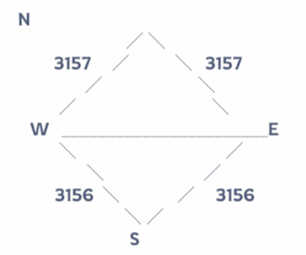

# First Time President Guide

Congrats on your first time as president!

If you've never been president before and don't have an experienced friend to ask questions, this guide is for you :)

**Immediately after castle battle:** Initiate Medical Advancement for healing.

## Skills

### First week of presidency

Establish a skill schedule that will work for SvS prep week.

- Sunday night 23:30 UTC — activate **Mercantilism** for construction buff all day Monday
- Monday night 23:30 UTC — activate **Research Advancement** for buff all day Tuesday
- Wednesday night 23:30 UTC — activate **Mobilize** for troop buff all day Thursday

We activate skills 30 minutes before reset because the lag time for scheduling the buffs again is 7 days and 30 minutes.

This sets you up for skills to be auto-enabled at 00:00 UTC (reset) the week of prep week. If you want both weeks to be 00:00 UTC you could schedule the first week to be 00:00, but you'd need to manually activate the 2nd week at 00:00 UTC. (Not recommended — if you get busy and can't be online for reset, your whole state will be waiting.)

### Week 2 of Presidency (SvS Prep Week)

We want our skills to correspond to the tasks the state is completing each day of prep.

- Monday reset 00:00 UTC — **Mercantilism** for construction buff
- Tuesday reset 00:00 UTC — **Research Advancement** for research buff
- Thursday 00:00 UTC — **Mobilize** for troop buff
- Friday night 23:30 UTC (before reset) — **Healing Advancement** for injuries that may occur Saturday morning before battle

> **Always announce a skill schedule to the state via a state declaration.**

### Other Skills

- **Supreme President's Will:** Supreme presidents receive a bonus skill that boosts troop lethality. Activate it for the days of foundry/canyon clash to support your alliances' victories. Or even Frost Fire!
- **Ceasefire:** Can be used to prevent a player from attacking other people within your state. Can be used to stop invaders from attacking in the morning before SvS battle.
- **Forced Exile:** Randomly teleports someone's city and gives them a 10 hr shield. There is a 4 hour cooldown each time you use this skill.

## Grants

Commendations can be shared with players of your state and alliance. In a healthy state, sharing commendations beyond just your own alliance rewards hard work. Or be selfish and use them for your own alliance only (:

## Appointments

When you first become president, you must manually open each appointment and select the box that says **"auto approve applications"** for the appointments to cycle on their own.

Regular presidents will have a box checked for **"victorious state"** (your own state). Supreme presidents have the option of selecting **"losing state"** if they want to include the state they beat in SvS in the ministry rotation.

- **Minister of the Interior:** Do not rotate this freely. This person can adjust ministry position times and move people up or down the wait list. Select someone you know won't mess with the list.

## President Perks

**Appointment buffs:** Presidents can receive any ministry buff and swap them out with only a 5 minute cooldown. Tap the President icon above the character on your profile and select different buffs from the pop-up menu.

## State Flag & Name

You can adjust the flag representing your state and pick a state nickname.

Keep in mind that choosing a certain flag may upset players within your state or deter recruits during server transfer — it may make people feel less welcome to join. It's probably best to keep it as an international flag.

The state name is an opportunity to show state culture and stand out from the rest that don't. We've used "Tacos and Titties" to great effect!

## Authority

Authority is the "currency" the President uses for Statewide Skills (see above). It is collected by the state, for the state, by completing dailies and gathering RSS on the map. Authority is collected slowly over time — pay close attention to the state Authority "bank."

### Authority Guidelines

- Minimum Authority should **never drop below 1 million.** This gives the state a worst-case-scenario cushion and ensures any incoming President can facilitate skills appropriately.
- Skills cost **45,000 Authority** per state buff.
- When the state has a good surplus, the President may elect to use it to purchase gems. Gem purchases cost **27,000 Authority** and can be used up to 3× per day. Each subsequent purchase is reduced by 100 gems.

Example:

| Use | Authority | Gems |
|---|---|---|
| 1st | 27,000 | 500 |
| 2nd | 27,000 | 400 |
| 3rd | 27,000 | 300 |

> **Gems should only be purchased when our Authority Bank is in excess of 1 million. No exceptions.**

## SvS Negotiations

### Rules of Engagement

**Cross-State SvS Negotiations:** There will be ongoing SvS Diplomats assigned to cross-state negotiations — ask who they are if you are unsure. The current President works in tandem with the negotiations team.

Sample SvS rules below:

- 10 UTC – 11 UTC: Attacks allowed
- 11 UTC – 12 UTC: **NO ATTACKS** allowed
- 12 UTC – End of Event: Attacks allowed, **except** Castle Red/Grey areas
- **No rallies** allowed by invaders — defending state may rally to protect their hive/state
- Please remain respectful in world chat
- Insulting language between states is prohibited
- If rules are violated, send reports to your R4/R5

### Castle Battle Territory

3156 will exclusively request the **Southern half** of the Castle Battle field — see diagram below.

<!-- TODO: add the territory diagram image at images/castle-battle-territory.png -->

The reason is simple: it's easier to see. If the other state is adamant, make sure we get the East or West half. The north is undesirable.

Let's also discuss appointments in the negotiations. This is an ideal time, as both states are on equal footing and it's in both parties' interest to share. A simple framework: winner gets priority on days when buffs are on, free-for-all every other time.

*— Jessie and the rest of VKS, 3156, Feb 2026*
